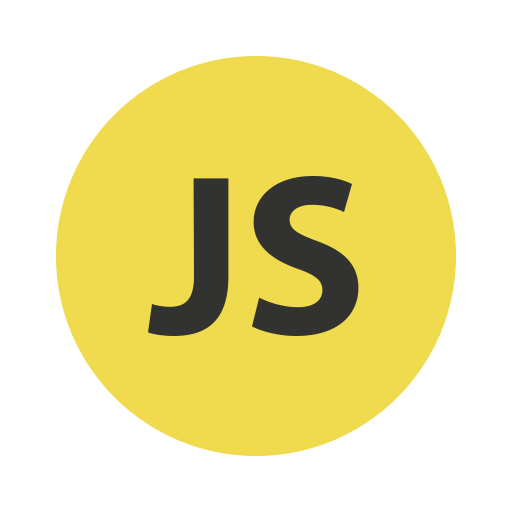
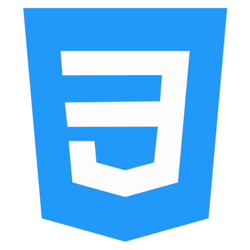

### Hi there 👋 
<!--
**anuragnewbie/anuragnewbie** is a ✨ _special_ ✨ repository because its `README.md` (this file) appears on your GitHub profile.

Here are some ideas to get you started: -->

I am Anurag Chatterjee, a tech enthusiast. I am currently pursuing MCA. I am very much fascinated with developing web applications and software applications. 
I am aiming to dive into Competitive Programming and challenge my own capabilities.🤓

- 🔭 I’m currently planning to work on my new personal project based on chat application.
- 🌱 I’m currently learning Full - Stack Web Development and DSA.
- 👯 I’m looking to collaborate for various hackathons.
- 💬 Ask me about anything related to tech.
- 📫 How to reach me: anuragchatterjee4@gmail.com

### MY SKILLS -->  

         

  

